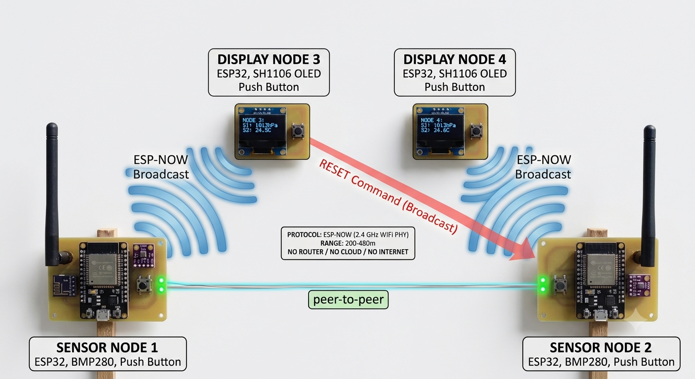

# 🔐 ESP-NOW Zero Trust IoT

### Design and Implementation of a Secure Decentralized IoT Communication System Using Zero Trust Architecture

[](https://www.espressif.com/)
[](https://docs.espressif.com/projects/esp-idf/en/stable/esp32/api-reference/network/esp_now.html)
[](https://en.wikipedia.org/wiki/Advanced_Encryption_Standard)
[](LICENSE)

---

## 📌 Project Overview

This is a **Final Year Project (FYP)** submitted at **Iqra University, Islamabad** for the degree of **BS Computer Science**.

The project demonstrates a **decentralized, infrastructure-free IoT network** using the **ESP-NOW protocol** on ESP32 microcontrollers. It operates completely **without a router, access point, or internet connection**. The system is built in **two phases**:

- **Phase 1** — Functional prototype with deliberate vulnerability demonstration (sniffing, injection, flooding attacks)
- **Phase 2** — Zero Trust security implementation (AES-128-CBC encryption + HMAC-SHA256 authentication + replay protection)

> *"Never Trust. Always Verify."* — Zero Trust Principle

---

## 👥 Team

| Role | Name |
|------|------|
| Team Member | Tanzeel Hussain |
| Team Member | Tayyab Nisar |
| Team Member | Yasir Yasin |
| Supervisor | Samavia Tariq |
| Co-Supervisor | Dr. Hafiz Mati Ur Rehman |

---

## 🏗️ System Architecture

The network consists of **4 ESP32 nodes** communicating via **ESP-NOW broadcast**:



> 📌 **Diagram:** [Open Full Size Diagram](diagrams/system-architecture.png)

---

## 🔧 Hardware Components

| Component | Model | Quantity | Purpose |
|-----------|-------|----------|---------|
| Microcontroller | ESP32 (38-pin) | 4 | 2 sensor nodes + 2 display nodes |
| Sensor | BMP280 | 2 | Temperature + Atmospheric Pressure |
| Display | SH1106 OLED (1.3 inch, 128×64) | 2 | Real-time data display |
| Button | Tactile Push Button (6×6mm) | 4 | Alert trigger + Reset command |
| Board | Breadboard (830-point) | 4 | Prototype assembly |

---

## 🔌 Hardware Wiring

### Sensor Node (×2)

| BMP280 Pin | ESP32 Pin | Function |
|------------|-----------|----------|
| VCC | 3.3V | Power Supply |
| GND | GND | Ground |
| SDA | GPIO 21 | I2C Data |
| SCL | GPIO 22 | I2C Clock |
| — | GPIO 4 | Push Button (Alert) |

### Display Node (×2)

| SH1106 OLED Pin | ESP32 Pin | Function |
|-----------------|-----------|----------|
| VCC | 3.3V | Power Supply |
| GND | GND | Ground |
| SDA | GPIO 21 | I2C Data |
| SCL | GPIO 22 | I2C Clock |
| — | GPIO 32 | Push Button (Reset) |

> 📌 **I2C Addresses:** BMP280 = `0x76` | SH1106 OLED = `0x3C` — No address conflict on shared bus.

> 📌 **Wiring Diagram:** See [Open Full Diagram](diagrams/wiring-diagram.png)

---

## 📦 Data Packet Structure

### Phase 1 — Plaintext (20 bytes)

```cpp
typedef struct {
    int   senderID;   // Node identifier (1, 2, 3, or 4)
    float temp;       // Temperature in Celsius
    float pressure;   // Pressure in hPa
    int   button;     // Alert flag (0 = normal, 1 = alert)
    int   command;    // Control command (0 = none, 1 = reset)
} Message;
```

### Phase 2 — Secure (64 bytes)

```cpp
typedef struct {
    int      senderID;    // Node identifier
    uint32_t timestamp;   // Unix epoch — replay protection
    uint32_t seqNumber;   // Monotonic counter — anti-replay
    float    temp;        // AES-128-CBC encrypted
    float    pressure;    // AES-128-CBC encrypted
    int      button;      // AES-128-CBC encrypted
    int      command;     // AES-128-CBC encrypted
    uint8_t  hmac[32];    // HMAC-SHA256 authentication tag
} SecureMessage;
```

---

## 💻 Source Code

```
ESP-NOW-Zero-Trust-IoT/
│
├── Phase1/
│   ├── Sender/
│   │   └── Sender.ino          ← Upload to Sensor Node 1 & 2
│   └── Receiver/
│       └── Receiver.ino        ← Upload to Display Node 3 & 4
│
├── Phase1-Attacks/
│   ├── Sniffer/
│   │   └── Sniffer.ino         ← Passive packet capture demo
│   ├── Injector/
│   │   └── Injector.ino        ← Fake data injection demo
│   └── Flooder/
│       └── Flooder.ino         ← Denial of Service demo
│
├── Phase2/
│   ├── Secure_Sender/
│   │   └── Secure_Sender.ino   ← AES + HMAC Sensor Node
│   └── Secure_Receiver/
│       └── Secure_Receiver.ino ← AES + HMAC Display Node
│
├── diagrams/
│   ├── system-architecture.drawio
│   ├── wiring-diagram.drawio
│   ├── use-case-diagram.drawio
│   └── activity-diagram.drawio
│
└── README.md
```

---

## 🚀 Getting Started

### Step 1 — Install Arduino IDE
Download from [arduino.cc](https://www.arduino.cc/en/software)

### Step 2 — Install ESP32 Board Package
In Arduino IDE:
```
File → Preferences → Additional Board Manager URLs:
https://raw.githubusercontent.com/espressif/arduino-esp32/gh-pages/package_esp32_index.json
```
Then: `Tools → Board → Boards Manager → Search "esp32" → Install`

### Step 3 — Install Required Libraries
In Arduino IDE: `Sketch → Include Library → Manage Libraries`

| Library | Version | Install Name |
|---------|---------|--------------|
| Adafruit BMP280 | 2.6.8 | `Adafruit BMP280 Library` |
| Adafruit Unified Sensor | 1.1.14 | `Adafruit Unified Sensor` |
| Adafruit GFX | 1.11.9 | `Adafruit GFX Library` |
| Adafruit SH110X | 2.1.10 | `Adafruit SH110X` |

### Step 4 — Upload Code

**For Sensor Node 1:**
1. Open `Phase1/Sender/Sender.ino`
2. Set `#define DEVICE_ID 1`
3. Select board: `Tools → Board → ESP32 Dev Module`
4. Upload ✅

**For Sensor Node 2:**
1. Open `Phase1/Sender/Sender.ino`
2. Change to `#define DEVICE_ID 2`
3. Upload ✅

**For Display Node 3:**
1. Open `Phase1/Receiver/Receiver.ino`
2. Set `#define DEVICE_ID 3`
3. Upload ✅

**For Display Node 4:**
1. Open `Phase1/Receiver/Receiver.ino`
2. Change to `#define DEVICE_ID 4`
3. Upload ✅

---

## 🔍 Phase 1 — Attack Demonstrations

The unprotected Phase 1 system is deliberately vulnerable to demonstrate the need for Zero Trust security.

### Attack 1 — Passive Sniffing (Confidentiality Violation)
```
Upload: Phase1-Attacks/Sniffer/Sniffer.ino
Result: All sensor packets visible in plaintext on Serial Monitor
```

### Attack 2 — Data Injection (Authentication Violation)
```
Upload: Phase1-Attacks/Injector/Injector.ino
Result: Fake temperature (999°C) appears on display, false alert triggered
```

### Attack 3 — Flooding DoS (Availability Violation)
```
Upload: Phase1-Attacks/Flooder/Flooder.ino
Result: Packet counter jumps rapidly, display updates degrade
```

---

## 🔐 Phase 2 — Zero Trust Security

Phase 2 adds a complete cryptographic security layer.

| Attack | Phase 1 | Phase 2 |
|--------|---------|---------|
| Passive Sniffing | ❌ Vulnerable | ✅ AES-128-CBC Encrypted |
| Data Injection | ❌ Vulnerable | ✅ HMAC-SHA256 Rejected |
| Replay Attack | ❌ Vulnerable | ✅ Timestamp Check Rejected |
| Packet Tampering | ❌ Vulnerable | ✅ HMAC Mismatch Dropped |
| Flooding DoS | ❌ Vulnerable | ⚡ Partially Mitigated |

### Performance Overhead

| Operation | Time |
|-----------|------|
| HMAC-SHA256 compute | ~180 µs |
| AES-128-CBC encrypt | ~25 µs |
| AES-128-CBC decrypt | ~25 µs |
| Total overhead | **< 0.5 ms per packet** |
| As % of 2-second cycle | **< 0.02%** |

---

## 📺 Display Screen Layout

```
+--------------------------------+
| N1:ON    N2:ON                 |
| T:25.3C  P:1013hPa             |
| T:26.1C  P:1014hPa             |
| ------------------------------ |
| R1:-55dBm  N:120               |
| R2:-62dBm  N:118               |
| Status: OK  /  *** ALERT ***   |
+--------------------------------+

R1/R2 = RSSI (Signal Strength in dBm)
N     = Packet Count
```

---

## 🛡️ Zero Trust Principles Applied

```
NEVER TRUST    →  No device trusted by default, even inside the network
ALWAYS VERIFY  →  Every packet verified with HMAC-SHA256 before processing
LEAST PRIVILEGE→  Nodes only process data they are authorized to receive
MONITOR ALWAYS →  RSSI, packet counters, and online/offline status tracked
```

---

## 📚 References

| # | Reference |
|---|-----------|
| [1] | Espressif Systems. ESP-NOW Protocol Overview. ESP-IDF Programming Guide v5.1. 2023. |
| [2] | NIST. Zero Trust Architecture. Special Publication 800-207. 2020. |
| [3] | Bosch Sensortec. BMP280 Digital Pressure Sensor Datasheet. 2020. |
| [4] | IEEE Standard 802.11-2020. Wireless LAN MAC and Physical Layer Specifications. |
| [5] | Santoso & Setiawan. AES Encryption for ESP-NOW-Based Home Automation. ICEECS 2021. |
| [6] | Kumar et al. Denial of Service Resilience in ESP-NOW Networks. IEEE IoT Journal, 2022. |
| [10] | Adafruit Industries. BMP280 Library Documentation v2.6.8. 2024. |
| [11] | Maier et al. Comparative Analysis of ESP32 for IoT Applications. ICAC 2019. |

---

## 📐 Diagrams

All diagrams are available in `diagrams/` folder as `.drawio` files.
Open them at [app.diagrams.net](https://app.diagrams.net) (draw.io).

| Diagram | File |
|---------|------|
| System Architecture | [Open Full Diagram](diagrams/system-architecture.png) |
| Hardware Wiring | [Open Full Diagram](diagrams/wiring-diagram.png) |
| Use Case Diagram | [Open Full Diagram](diagrams/use-case-diagram.png) |
| Activity Diagram | [Open Full Diagram](diagrams/activity-diagram.png) |

---

## 📄 License

This project is for academic purposes under **MIT License**.

---

<div align="center">

**Iqra University Islamabad — BS Computer Science — Final Year Project 2026**

*"Never Trust. Always Verify."*

</div>
